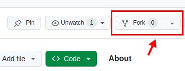
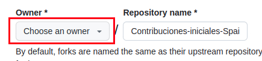
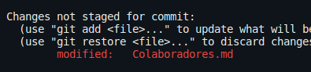
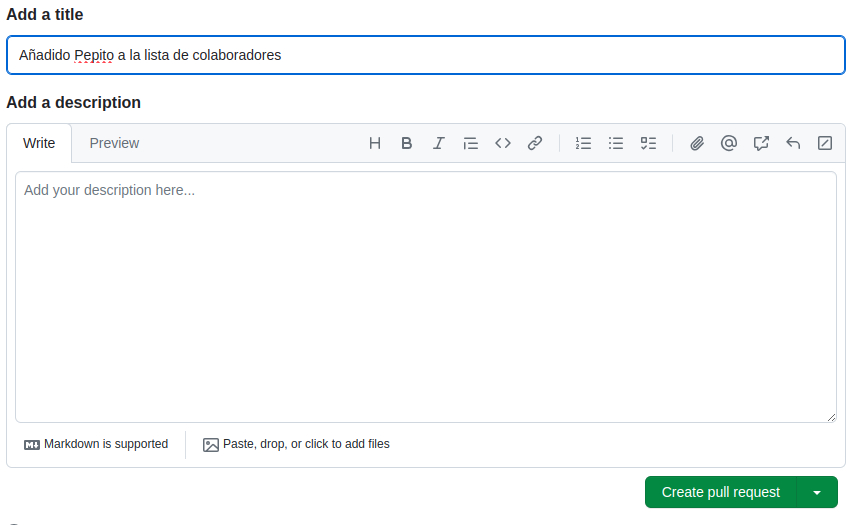

# Primeras Contribuciones

Dar los primeros pasos puede resultar intimidante. La inexperiencia al colaborar con otros puede llevar a cometer errores, lo cual puede ser desalentador. La misión de este repositorio es facilitar el proceso para que los nuevos contribuidores en el mundo del código abierto aprendan y se involucren.

Aunque leer artículos y ver tutoriales es útil, ¿qué mejor manera de aprender que sumergirse en la práctica? Este proyecto se centra en ser una guía amigable y simplificada para que los principiantes den sus primeras contribuciones. Si estás listo para dar el primer paso, sigue los pasos que se detallan a continuación.

## Bifurca (*Fork*) este repositorio 

Realiza un fork de este repositorio haciendo clic en el botón 'Fork' ubicado en la esquina superior derecha de esta página. Esto generará una copia de este repositorio en tu cuenta de GitHub.


Recuerda que debes seleccionar tu nombre de usuario de github en owner 
<br>
<br>
<br>

## Abre un Codespaces en el repositorio bifurcado


Ahora abre un codespace de este repositorio haciendo click en los botones de Code y Create codespace on main. 
<br>
<br>
<br>
<br>
<br>
<br>
<br>
<br>
<br>
<br>
<br>
<br>

## Crea una rama (*Branch*)

Desde la terminal de tu codespaces, crea una rama (*branch*) usando el comando  `git checkout`:
```
git checkout -b <añade tu nombre>
```

Por ejemplo:
```
git checkout -b pepito-perez
```
## Navega usando la terminal
Usando únicamente la terminal de codespaces, busca un archivo llamado Instrucciones.txt , ábrelo y sigue las instrucciones del mismo.
Una vez hayas terminado continúa con este README.

## Haz los cambios necesarios en Colaboradores.md y confirma (*Commit*) esos cambios

Abre el archivo `Colaboradores.md` añade tu nombre utilizando este formato 
<br>
`[Pepito Perez](https://github.com/Pepito_Perez/)`  


Ahora escribe en la terminal `git status`, verás que hay cambios.
<br>
<br>
<br>
<br>
<br>
Agrega esos cambios a la rama (*branch*) que creaste anteriormente usando el comando `git add`:

```
git add .
```

Ahora haz un *commit* sobre estos cambios ejecutando el comando `git commit`:
```
git commit -m "Añadido <tu-nombre> a la lista de colaboradores"
```
cambiando `<tu-nombre>` con tu nombre.

## Sube (*Push*) tus cambios a GitHub

Haz *push* de tus cambios usando el comando `git push`:
```
git push origin <añade-el-nombre-de-la-rama>
```
Reemplaza `<añade-el-nombre-de-la-rama>` con el nombre de la rama que creaste anteriormente.

## Envía (*Submit*) tus cambios para ser revisados

Si vas a tu repositorio en GitHub, verás un botón `Compare & pull request`. Haz click sobre este botón. 

<br>
<br>
<br>
<br>
<br>
<br>
<br>


Ahora envía la *pull request*.




<br>
<br>
<br>
<br>
<br>
<br>
<br>
<br>
<br>
<br>
<br>
<br>
<br>
<br>
<br>

## Términos Básicos de Git y GitHub

1. **Fork:** Crear una copia independiente de un repositorio en GitHub. Esto permite a los usuarios trabajar en su propia versión del proyecto sin afectar el original.

2. **Branch:** Una línea de desarrollo independiente en un repositorio de Git. Los branches permiten a los desarrolladores trabajar en nuevas características o solucionar problemas sin alterar la rama principal (también conocida como `main` o `master`).

3. **Git Checkout:** Un comando utilizado para cambiar entre branches.

4. **Git Status:** Un comando que muestra el estado actual de los archivos en el repositorio de Git, incluyendo los cambios sin añadir (`untracked`), los cambios añadidos pero no confirmados (`staged`), y los cambios confirmados (`committed`).

5. **Git Add:** Un comando utilizado para añadir cambios realizados en archivos al área de preparación de Git. Esto prepara los archivos para ser confirmados en un commit.

6. **Git Commit:** Un comando utilizado para confirmar los cambios añadidos al área de preparación de Git. Cada commit tiene un mensaje asociado que describe los cambios realizados.

7. **Git Push:** Un comando utilizado para subir commits locales a un repositorio remoto en GitHub. Esto sincroniza los cambios realizados en tu repositorio local con el repositorio remoto.

8. **Compare and Pull Request:** Comparar y solicitar una fusión de cambios entre dos branches en un repositorio de GitHub. Un pull request permite a los colaboradores proponer cambios en un proyecto, revisar los cambios propuestos por otros y discutir los cambios antes de fusionarlos en la rama principal.

9. **Pull Request:** Una solicitud formal para fusionar los cambios realizados en una rama (generalmente una rama de funcionalidad o solución de problemas) con la rama principal del repositorio. Los pull requests son revisados por otros colaboradores antes de ser fusionados.

10. **Merge:** Fusionar los cambios realizados en una rama con otra rama en un repositorio de Git. El merge combina los cambios de dos branches y los une en una sola rama, manteniendo el historial de cambios de forma ordenada.

## Has terminado

Ahora me toca a mi revisar tus cambios y fusionarlos (haciendo *merge*) con la rama main de este proyecto. Recibirás una notificación por correo electrónico cuando los cambios hayan sido fusionados.

## Gracias
Si este repositorio te ha sido útil, ¡considera marcarlo con una estrella ⭐ y seguirme en mi perfil de GitHub para estar al tanto de nuevos proyectos y actualizaciones!

[¡Sígueme en GitHub!](https://github.com/EduardoHernandezGuzman)